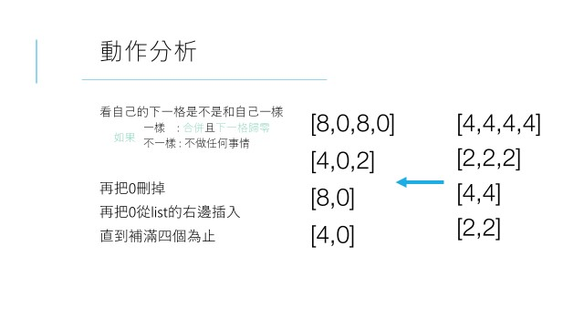

# 前端程式設計期末專題-2048
## 專題動機
從國中開始出現的2048遊戲，當時連完5小時都無法湊到2048，這次上前端程式設計期末專案，我腦海中第一浮現便是2048，重新回到那時候玩2048的熱情，也可以讓所有同學回到最初的回憶！

## 2048遊戲規則
透過上下左右鍵移動畫面上的數字區塊，同數字會合併變成兩倍，透過不斷合併的過程，讓自己達到2048破關；相反地，如果上下左右皆無法合併時，便是Gameover啦！

## 2048 邏輯
2048遊戲邏輯是什麼呢? 其實很簡單，以下將以投影片介紹

上圖為向左加入動作分析，那向上加入便是順時針旋轉90度，透過這樣的方式定義好各情況的Matrix方向便可以快速完成啦！

## 專題技術
* 透過上下左右鍵操控數字色塊
* Score右上角設計一個小圖示來呈現分數添加的驚喜
* 各個數字區塊合併加入Transition的特效，給使用者視覺上的饗宴
* 在遊戲結束時，彈出提示視窗示意使用者再加油！
* 利用JQuery做出字體換色的效果~
